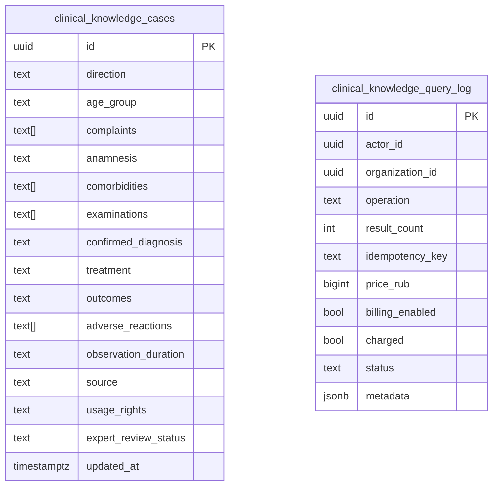

# Data model — Clinical Knowledge

```mermaid
erDiagram
  clinical_knowledge_cases {
    uuid id PK
    text direction
    text age_group
    text[] complaints
    text anamnesis
    text[] comorbidities
    text[] examinations
    text confirmed_diagnosis
    text treatment
    text outcomes
    text[] adverse_reactions
    text observation_duration
    text source
    text usage_rights
    text expert_review_status
    timestamptz updated_at
  }
  clinical_knowledge_query_log {
    uuid id PK
    uuid actor_id
    uuid organization_id
    text operation
    int result_count
    text idempotency_key
    bigint price_rub
    bool billing_enabled
    bool charged
    text status
    jsonb metadata
  }
```

Case statuses: draft, pending_review, approved, rejected, archived. Only approved cases enter search.
